# Backend Changelog

<!--

## 2026-04-20

**[face-preservation] 2026-04-20 13:44** — `IMG_7641.jpg` / `maltese/teddy_cut`
- 업로드: https://res.cloudinary.com/dubnzx8ew/image/upload/v1776660185/grooming-style/uploads/k8a84nkds9jqafm6koam.jpg
- 결과: https://res.cloudinary.com/dubnzx8ew/image/upload/v1776660263/grooming-results/ittaiq8ekpyjxvvbieng.jpg
- MAE: 26.5 / 기준 25.0 [FAIL]

## 작성 가이드

**정렬**: 최신 날짜가 맨 위 · 같은 날짜 안에서도 최신 Phase가 위 (번호 높을수록 위)

**Phase 템플릿**

**[face-preservation] 2026-04-20 13:48** — `IMG_7641.jpg` / `maltese/teddy_cut`
- 업로드: https://res.cloudinary.com/dubnzx8ew/image/upload/v1776660433/grooming-style/uploads/iej1zyd0r3o3qwtk2yi9.jpg
- 결과: https://res.cloudinary.com/dubnzx8ew/image/upload/v1776660526/grooming-results/qohwixarzm6mhxzb0fvs.jpg
- MAE: 73.9 / 기준 25.0 [FAIL]

**[face-preservation] 2026-04-20 14:00** — `IMG_7641.jpg` / `maltese/teddy_cut`
- 업로드: https://res.cloudinary.com/dubnzx8ew/image/upload/v1776661150/grooming-style/uploads/ursgozk2pdohr0zepv6s.jpg
- 결과: https://res.cloudinary.com/dubnzx8ew/image/upload/v1776661229/grooming-results/fjt6s5lhrb8qjhdninvf.jpg
- MAE: 14.8 / 기준 25.0 [PASS]

**[face-preservation] 2026-04-20 14:27** — `IMG_7641.jpg` / `maltese/teddy_cut`
- 업로드: https://res.cloudinary.com/dubnzx8ew/image/upload/v1776662763/grooming-style/uploads/ixglbspcr7llyrkszktj.jpg
- 결과: https://res.cloudinary.com/dubnzx8ew/image/upload/v1776662862/grooming-results/anq8lv6koseau5xxhtie.jpg
- MAE: 14.0 / 기준 25.0 [PASS]

**[face-preservation] 2026-04-20 14:43** — `IMG_7641.jpg` / `maltese/teddy_cut`
- 업로드: https://res.cloudinary.com/dubnzx8ew/image/upload/v1776663712/grooming-style/uploads/sieru25gwbdwu693x6jd.jpg
- 결과: https://res.cloudinary.com/dubnzx8ew/image/upload/v1776663805/grooming-results/ukxxriwrmlfjgzhjlkzn.jpg
- MAE: 88.5 / 기준 25.0 [FAIL]

**[face-preservation] 2026-04-20 14:45** — `IMG_7641.jpg` / `maltese/teddy_cut`
- 업로드: https://res.cloudinary.com/dubnzx8ew/image/upload/v1776663881/grooming-style/uploads/xayu3k76xj0cb4xhnzfr.jpg
- 결과: https://res.cloudinary.com/dubnzx8ew/image/upload/v1776663954/grooming-results/sps7jennvi1j2r1qrbta.jpg
- MAE: 53.1 / 기준 25.0 [FAIL]

### N. 제목 — 한 줄로 무슨 작업인지 명시

배경이나 동기가 있으면 제목 바로 아래 한두 문장으로. (선택)

**추가**
- `경로/파일명` — 한 줄 설명

**수정**
- `경로/파일명` — 변경 내용 한 줄 요약

**삭제**
- `경로/파일명` — 삭제 이유

**트러블슈팅**
> **문제 제목**
> - 증상:
> - 원인:
> - 해결:

**시도한 접근**
> **시도 제목 — 실패/보류**
> - 방법:
> - 결과:
> - 대안:

**평가** _(테스트 조건 명시)_ (선택)
- 항목별 결과 및 향후 과제

**규칙**: 같은 작업 흐름은 같은 Phase에 묶을 것 · 트러블슈팅/시도는 반드시 blockquote 형식
-->

## AI 파이프라인 변화 흐름

```mermaid
flowchart TD
    A["초기 (2026-04-09)\nReplicate: ControlNet + SAM + PIL 합성"]
    B["파라미터 튜닝\nsteps 30→50 · condition_scale 0.5→0.7\n소프트 마스크(Gaussian blur)"]
    C["LoRA 학습 인프라 추가\nlora_registry.json · lora_training.py · admin.py"]
    D["Gemini 파이프라인 도입\ngemini-2.0-flash + SAM compositing 병렬 실행"]
    E["ghost 현상 발생\nSAM 좌표 기반 합성 — Gemini 재생성 이미지와 불일치"]
    F["SAM 제거 + 프롬프트 강화\nCRITICAL REQUIREMENTS 4개 항목으로 눈/코/입 보존 지시"]
    G["메인 파이프라인 교체\nReplicate 완전 제거 · Gemini 단독 운영"]
    H["HEIC 지원\npillow-heif · _convert_to_jpeg_if_needed()"]
    I["털 색상 정밀화\n_extract_dominant_fur_colors() — RGB 실측값 → 프롬프트"]
    J["모델 업그레이드\ngemini-3.1-flash-image-preview\n+ 2단계 분석 파이프라인(_analyze_dog_features)"]
    K["Vertex AI Imagen 3 인프라\nimagen_registry.json · vertex_imagen_training.py\nImagen-first + Gemini fallback 라우팅"]
    L["얼굴 특징점 정렬 합성\n_detect_face_keypoints() + 유사 변환\n원본 얼굴 픽셀을 생성 이미지 위치에 정렬 합성"]
    M["원본 좌표계 고정 합성\n_detect_face_bbox() — Gemini 단일 bbox\n생성 이미지 워핑 → 원본 얼굴 픽셀 유지"]
    N["FLUX.1-fill 인페인팅 도입\nGemini feature bbox 탐지\n눈/코/입 개별 검정(보존) — 털 흰색(인페인팅)"]
    O["얼굴 전체 보존 마스크\n_detect_face_bbox() + 30% 패딩 타원\n얼굴 전체 검정(보존) — ghost 원천 차단"]

    A -->|"seam 아티팩트"| B
    B --> C
    C -->|"Gemini 추가 시도"| D
    D -->|"ghost 현상"| E
    E --> F
    F --> G
    G --> H
    H --> I
    I --> J
    J --> K
    K -->|"keypoint 탐지 불안정"| L
    L -->|"직렬 실패 체인"| M
    M -->|"ghost 현상 재발"| N
    N -->|"FLUX ghost 아티팩트"| O

    style E fill:#fee2e2,stroke:#ef4444
    style L fill:#fee2e2,stroke:#ef4444
    style N fill:#fee2e2,stroke:#ef4444
    style O fill:#d1fae5,stroke:#10b981
```

---

## 2026-04-20

### 30.1 — drift 임계값 완화 (0.25 → 0.6)

**배경**
- Phase 30 적용 후 첫 테스트(`~/Downloads/IMG_7641.jpg`, maltese/teddy_cut)에서 눈 양쪽 모두 drift 0.35~0.49로 `drift_too_large` skip 발동 → 눈 합성 실패, nose만 합성된 하이브리드 결과.
- 사용자 피드백: "주둥이 부분만 가져온 것 같고 눈·입·코는 다 변함".
- 분석: drift가 크다는 건 Gemini가 얼굴 위치를 이동시켰다는 신호. 합성은 `dst_parts` 탐지 결과(결과 이미지의 실제 눈 위치)에 paste 하므로 drift가 커도 위치는 보정됨. 0.25 임계는 과보수적.

**변경**
- `services/gemini_pipeline.py` — `_MAX_DRIFT_RATIO` 0.25 → 0.6. 주석에 "dst_parts 탐지로 paste 위치가 보정되므로 보수적 0.25는 과엄격이었음" 추가.

**테스트 결과 (2026-04-20 재실행)**
- 결과 URL: https://res.cloudinary.com/dubnzx8ew/image/upload/v1776663954/grooming-results/sps7jennvi1j2r1qrbta.jpg
- Gating meta (모두 skip=None, 합성 성공):
  - `left_eye`: drift=0.38, mask_area=0.55, active_px=1110
  - `right_eye`: drift=0.40, mask_area=0.52, active_px=1049
  - `nose`: drift=0.04, mask_area=0.29, active_px=1519
  - `mouth`: disabled
- `gemini_calls=1` (재호출 없이 한 번에 통과)

**사용자 관찰 (다음 단계 과제)**
- 이전 결과 대비 훨씬 자연스러워짐.
- 눈: 합성되었으나 "합성 복사본이 눈 위에 떠 있는" 느낌이 있음 → 원본 눈 크롭이 dst 영역 안에서 주변 털과 경계가 어긋나 붙은 상태로 추정. 후속 개선 과제.
- 코: 합성 성공, 다만 크기가 다소 크게 paste됨 → `nose` bbox padding이 넓거나 원본 bbox 자체가 크게 탐지된 영향. 후속 개선 과제.
- 입: `FACE_PRESERVE_MOUTH=False` 정책 유지. Gemini 결과 그대로.
- 전체적으로 "가능한 방향"임을 확인. 미세 부자연스러움은 차차 해결.

**측정 방식 메모**
- `run_face_preservation.py`의 MAE는 "원본 bbox 좌표" 기준으로 측정 → Gemini가 얼굴을 이동시키면 원본 좌표 영역에는 변형된 털이 남아 MAE 수치는 높게 나옴(FAIL). 실제 합성물은 dst 위치로 paste되어 있음. 수치와 시각 결과가 엇갈리는 케이스 존재.

---

### 30. v5 얼굴 보존: gating 우선 + mouth 기본 OFF

**배경**
- 원형 얼굴·눈이 털에 파묻힌 샘플(`~/Downloads/IMG_7641.jpg`)에서 마스크 휴리스틱만으로는 구조적 seam 발생
- 방향 전환: "합성을 더 잘 되게" 가 아니라 "실패할 샘플은 합성하지 않는다" (사용자 확정)

**변경**
- `services/gemini_pipeline.py` 상단 상수 추가: `FACE_PRESERVE_MOUTH=False`, `_MAX_MASK_AREA_RATIO=0.65`, `_MAX_DRIFT_RATIO=0.25`, `_MIN_MANDATORY_PARTS_OK=2`
- `_create_contour_mask()` 반환 시그니처 `(Image, dict)` 로 확장 — meta: ellipse_fallback, active_pixels, mask_area_ratio, component_count
- `_compute_drift_ratio()` 헬퍼 신설 — 비율 스케일 투영만 사용(Phase 14 금지 준수)
- `_composite_face_parts()` 에 mouth 기본 스킵 + 4조건 gating(active_pixels_low / ellipse_fallback / mask_area_too_large / drift_too_large) 추가. 반환 `(bytes, list[dict])` 로 확장
- `run_gemini_pipeline()` gate-fail 재호출 추가: mandatory(eyes+nose) 중 2개 이상 skip 시 1회 재호출. 색상 재시도와 합산해 최대 2회 상한(`retry_budget`). `meta_out` 파라미터로 테스트 meta 노출
- `tests/run_face_preservation.py` 파트별 meta 출력 + 루트 `TEST_RESULTS.md` part-level detail 표 append

**폐기/충돌 없음**
- Phase 28(pyramid blend) 이미 폐기 상태 유지
- Phase 29(ellipse fallback 시 합성 스킵)는 이번 변경에 통합(명시적 플래그화)

---

**[face-preservation] 2026-04-20 13:44** — `IMG_7641.jpg` / `maltese/teddy_cut`
- 업로드: https://res.cloudinary.com/dubnzx8ew/image/upload/v1776660185/grooming-style/uploads/k8a84nkds9jqafm6koam.jpg
- 결과: https://res.cloudinary.com/dubnzx8ew/image/upload/v1776660263/grooming-results/ittaiq8ekpyjxvvbieng.jpg
- MAE: 26.5 / 기준 25.0 [FAIL]

**[face-preservation] 2026-04-20 13:48** — `IMG_7641.jpg` / `maltese/teddy_cut`
- 업로드: https://res.cloudinary.com/dubnzx8ew/image/upload/v1776660433/grooming-style/uploads/iej1zyd0r3o3qwtk2yi9.jpg
- 결과: https://res.cloudinary.com/dubnzx8ew/image/upload/v1776660526/grooming-results/qohwixarzm6mhxzb0fvs.jpg
- MAE: 73.9 / 기준 25.0 [FAIL]

### 29. pyramid blend 롤백 + ellipse fallback 시 합성 스킵

배경: Phase 28 pyramid blend 도입 실험에서 ① 흰 점 박스 아티팩트(ellipse fallback mask + pyramid blend 경계 노출) ② 얼굴 위치 이탈(bbox 정렬 실패 시 원본 파트가 털 위에 paste) 두 문제가 확인됨. Phase 28 "대안" 항목(ellipse fallback 시 합성 스킵 / 눈은 paste로 복귀)을 실행해 Phase 26 구조로 되돌리고 오-위치 합성을 방어.

**수정**
- `services/gemini_pipeline.py` — `_composite_face_parts()` 합성 분기를 Phase 26 구조로 복귀
  - 눈(left_eye·right_eye): pyramid blend 제거 → 직접 paste
  - 코·입(nose·mouth): seamless clone → paste fallback (pyramid blend 중간 단계 제거)
- `services/gemini_pipeline.py` — contour mask가 비어 있으면(`active_pixels < _MIN_MASK_PIXELS`) ellipse 타원 마스크 생성 대신 `continue`로 해당 파트 합성 스킵. Gemini 결과를 그대로 유지
- `services/gemini_pipeline.py` — `from PIL import ImageDraw` 제거 (ellipse 마스크 생성 코드 삭제로 불필요)

**삭제**
- `services/gemini_pipeline.py` — `_pyramid_blend()` 함수 전체 제거. 다른 호출처 없음 확인

**트러블슈팅**

> **흰 점 박스 아티팩트**
> - 증상: 결과 이미지 눈 위치에 bbox 크기의 흰 점 박스 노출
> - 원인: ellipse fallback mask(bbox 전체 원형)로 pyramid blend를 실행하면 bbox 경계가 합성 경계선으로 그대로 노출됨
> - 해결: pyramid blend 제거 + ellipse fallback 트리거 시 합성 스킵

> **얼굴 파트 위치 이탈 (MAE 73.9 케이스)**
> - 증상: left_eye 크롭이 털만 잡히고(눈 없음) nose/mouth bbox도 전혀 다른 위치에 합성
> - 원인: Gemini 결과에서 얼굴 위치가 이동했을 때 `_create_contour_mask()` 3중 threshold 전략이 모두 실패 → ellipse fallback으로 bbox 전체 원형 mask 사용 → 원본 파트 크롭이 잘못된 좌표에 paste됨
> - 해결: ellipse fallback 조건(active_pixels < 50)에서 합성 자체를 스킵. 잘못된 위치 paste보다 Gemini 원본 유지가 안전하다는 판단

**평가** _(run_face_preservation.py / `IMG_7641.jpg` / `maltese/teddy_cut`)_
- Parts MAE 14.8 (기준 25.0) [PASS] — Phase 28 시도의 26.5·73.9 대비 대폭 개선
- 시각 확인: 흰 점 박스 아티팩트 제거 / 얼굴 파트가 털 위에 떠 있지 않음

---

### 28. _create_contour_mask 3중 threshold + _pyramid_blend 도입 시도 — 실패

검은 푸들처럼 어두운 개에서 `percentile(gray, 25)` ≈ 15-20 → threshold=15 → `active_pixels < 50` → ellipse fallback → 눈 위치에 금색 원형 패치 노출 문제. 이를 해결하기 위해 contour_mask를 3중 threshold 전략 + connectedComponentsWithStats 기반으로 교체하고, 눈 합성에 Laplacian pyramid blending 도입 시도.

**추가**
- `services/gemini_pipeline.py` — `_pyramid_blend()` 신규 함수 추가
  - Laplacian pyramid blending (cv2만 사용, scipy 제거)
  - adaptive levels: min_side < 24 → 2단계, < 48 → 3단계, 이상 → 4단계
  - 경계 침범 시 clip ROI 처리
  - mask_std < 0.15이면 추가 feathering 적용, 이상이면 생략
  - 실패 시 None 반환 → 호출부 paste fallback
- `from typing import Optional` import 추가

**수정**
- `services/gemini_pipeline.py` — `_create_contour_mask()` 전면 교체
  - 시그니처에 `part_name: str = ""` 추가
  - 3중 threshold 전략: A(percentile 25 + 절대 80 min) → B(mean - 0.8*std) → C(percentile 20) 순서로 시도
  - cv2 connectedComponentsWithStats로 component 선택
    - 눈/코: 혼합 점수 `dist - 0.3 * sqrt(area)` 최소값 선택
    - 입: 면적 상위 2개 + 중심 거리 제약 (0.6 * min_side)
  - morphology: open 1회(보수적) → close 1-2회(crop 크기 기반)
  - dilation 하한: min_side < 30 → 3, 이상 → 5
  - blur 하한: min_side < 30 → 2, 이상 → 3 / 상한 5
  - 모든 threshold 실패 시 zeros 마스크 반환 (기존 단일 threshold 실패 시 그대로 처리하던 것 개선)
  - component 선택 결과·feathering 파라미터 logger 출력
- `services/gemini_pipeline.py` — `_composite_face_parts()` 합성 분기 교체
  - `_create_contour_mask()` 호출에 `part_name=part["name"]` 추가
  - 눈: paste → pyramid blend 우선, 실패 시 paste fallback
  - 코·입: seamless clone 우선 → pyramid blend fallback → paste final fallback

**트러블슈팅**

> **pyramid_blend 브로드캐스팅 오류 — 수정**
> - 증상: `operands could not be broadcast together with shapes (34,37,3) (34,37)`
> - 원인: blended 루프에서 resize가 발생하지 않는 경우(shape 일치) ndim 체크가 실행되지 않아 2D mask가 3D 이미지 배열과 연산 시도
> - 해결: `if m.ndim == 2:` 체크를 resize 분기 밖으로 이동 — 항상 3D 보장. gp_mask pyrDown 결과도 동일하게 ndim 체크 추가

**시도한 접근**

> **pyramid_blend 도입 — 실패 (MAE 73.9, 박스 아티팩트 발생)**
> - 방법: 눈 합성을 paste에서 pyramid blend로 교체. ellipse fallback mask(bbox 전체 원)로도 pyramid blend 실행
> - 결과: MAE 73.9 (이전 paste 방식 26.5보다 크게 증가). 결과 이미지 눈 위치에 흰 점 박스 아티팩트 노출. bbox 위치 이탈(left_eye 크롭이 털만 잡힘)
> - 원인: ① ellipse fallback mask로 pyramid blend를 실행하면 bbox 전체 경계가 합성 경계선으로 노출됨 ② bbox 정렬 실패(Gemini 결과에서 얼굴 위치 이동)는 합성 방식 교체로 해결 불가 ③ pyramid blend가 눈 원본 픽셀 정보를 희석시킴
> - 대안: ① ellipse fallback 시 합성 스킵 ② 눈은 이전처럼 paste로 되돌리기

---

## 2026-04-15

**현재 파이프라인 상태 (2026-04-15)**
- 털 색상 및 눈 색깔이 원본과 달라지는 현상 확인 (스타일 변환 의도 범위 초과)
- 눈·코·입 위치(bbox 좌표)는 정확하게 보존됨

---

**[face-preservation] 2026-04-15 15:38** — `IMG_7641.jpg` / `maltese/teddy_cut`
- 업로드: https://res.cloudinary.com/dubnzx8ew/image/upload/v1776235081/grooming-style/uploads/rbfunhb8ikljiovwiykf.jpg
- 결과: https://res.cloudinary.com/dubnzx8ew/image/upload/v1776235129/grooming-results/rlsuckws1k7loc280twx.jpg
- MAE: 17.7 / 기준 25.0 [PASS]

**[face-preservation] 2026-04-15 15:50** — `IMG_7641.jpg` / `maltese/teddy_cut`
- 업로드: https://res.cloudinary.com/dubnzx8ew/image/upload/v1776235754/grooming-style/uploads/ao3vwvjsmbnqbn5qvgth.jpg
- 결과: https://res.cloudinary.com/dubnzx8ew/image/upload/v1776235842/grooming-results/fo1urob8el4drn0tvtg3.jpg
- MAE: 64.6 / 기준 25.0 [FAIL]

### 27. 얼굴 파트 합성 좌표 불일치 수정 + 입 탐지 추가

**배경**: 원본 이미지에서 탐지한 눈·코 bbox 좌표를 결과 이미지에 단순 비율 변환으로 적용하고 있었음.
Gemini 생성 결과에서 얼굴 위치가 조금이라도 달라지면 눈·코가 엉뚱한 위치에 붙는 구조적 문제.
또한 입(mouth)은 탐지·합성 대상에서 아예 빠져 AI 생성본이 그대로 남는 문제.

**수정**
- `services/gemini_pipeline.py` — `_detect_face_parts_bboxes()` mouth 탐지 추가
  - 탐지 파트: left_eye·right_eye·nose → left_eye·right_eye·nose·mouth
  - JSON 반환 포맷·프롬프트·`_parse_parts()` 순회에 `"mouth"` 추가
  - 공통 파트명을 `_FACE_PART_NAMES` 상수로 분리
- `services/gemini_pipeline.py` — `_composite_face_parts()` `dst_parts` 파라미터 추가
  - 결과 이미지에서 탐지한 face_parts를 목적지 좌표로 사용 (Gemini 얼굴 이동 보정)
  - `dst_lookup`: 이름으로 매칭 후 결과 이미지 실제 파트 위치를 destination으로 적용
  - 결과 이미지 탐지 실패 시 기존 비율 변환 fallback 유지
- `services/gemini_pipeline.py` — `run_gemini_pipeline()` 결과 이미지 face parts 탐지 추가
  - Gemini 생성 후 `_detect_face_parts_bboxes(result_bytes, gemini_client)` 호출 → `dst_parts`
  - `_composite_face_parts(image_bytes, result_bytes, face_parts, dst_parts)` 로 전달

**트러블슈팅**
> **테스트 1회차 회색화 + right_eye contour mask empty — FAIL (MAE 64.6)**
> - 증상: Gemini가 회색 개를 생성(회색화), right_eye mask active_px=0
> - 원인: ① 회색화는 Gemini 생성 품질 문제 (색상 보존 실패, 기존 미해결 이슈)
>          ② right_eye dst bbox(55×56px)가 너무 작아 contour mask가 비었다고 판정 → ellipse fallback
> - 상태: 색상이 정상인 결과로 재평가 필요

---

### 26. 눈 합성 방식 변경 — seamlessClone → paste (눈 색 보존)

**배경**: seamlessClone은 source-destination 색 차이가 클 때 source 색을 destination 쪽으로 tint시키는 알려진 동작이 있다.
Gemini 생성 결과에서 눈 주변 털 색이 원본과 다르면, Poisson 경계 보정 과정에서 원본 눈 색까지 끌려가 눈 색이 변하는 문제가 발생했다.

**수정**
- `services/gemini_pipeline.py` — `_composite_face_parts()` 파트별 합성 분기 추가
  - `left_eye`, `right_eye`: seamlessClone 건너뛰고 contour mask alpha paste 직접 사용
  - `nose`: 기존과 동일 — seamlessClone 먼저, 실패 시 paste fallback

**평가** _(IMG_7641.jpg / maltese/teddy_cut)_
- MAE 17.7 / 기준 25.0 → PASS (최초 측정 — seamlessClone 제거 후)

---

### 25. 미용 스타일 적용 강화 + 얼굴 파트 복원 신뢰성 개선

**배경**: 결과 이미지에서 미용 스타일이 거의 반영되지 않고 눈·코·입이 Gemini에 의해 바뀌는 문제.
원인: ① style_prompts.py에 색상 수식어 잔존 → ABSOLUTE COLOR RULE과 충돌하여 Gemini가 스타일 적용을 억제,
② 프롬프트가 색상 보존 규칙으로 시작하여 Gemini가 "변경 최소화"로 해석,
③ contour mask가 비어 있을 때 (bbox가 털 위에 착지) 얼굴 파트 복원이 no-op으로 끝나는 구조적 문제.

**수정**
- `services/style_prompts.py` — 색상 수식어 10건 제거 (Phase 16 규칙 이행)
  - maltese/puppy_cut: `clean white fluffy coat` → `clean fluffy coat`
  - bichon/round_cut: `fluffy white head`, `pristine white coat` → `fluffy head`, `pristine coat`
  - bichon/puppy_cut, teddy_cut: `short/even fluffy white coat` → `short/even fluffy coat`
  - spitz/natural_cut, round_cut, bear_cut: `white double coat`, `white coat`, `white coat` 제거
  - mini_bichon/round_cut, teddy_cut, puppy_cut: 동일 패턴 제거
- `services/gemini_pipeline.py` — `enhanced_prompt` 재구성
  - `TASK:` 절로 시작 → Gemini가 "스타일 변환 작업"임을 첫 줄에서 인식
  - `GROOMING REQUIREMENTS` 1번: "MUST be clearly and visibly applied" 명시
  - 강아지 자세·위치를 바꾸지 않는다는 요건(4·5번) 명시
  - COLOR RULE을 GROOMING 뒤로 이동 + "does NOT restrict the style change" 단서 추가
  - `ABSOLUTE COLOR RULE` 헤더 제거 — 스타일 전체를 덮어쓰는 인상 제거
- `services/gemini_pipeline.py` — 빈 마스크 타원 fallback 추가 (`_composite_face_parts()`)
  - `_create_contour_mask()` 결과에서 `active_pixels = (mask_arr >= 16).sum()`으로 픽셀 개수 계산 (alpha 총합 아님)
  - `active_pixels < _MIN_MASK_PIXELS(50)` 이면 bbox 전체를 채우는 타원 마스크로 강제 복원
  - 경고 로그에 파트명·active_px·bbox 좌표·크기 포함
- `tests/run_face_preservation.py` — `_compute_face_mae()` dark pixel 한정 MAE 추가
  - `mae_full` (전체 픽셀, 기존 방식)과 `mae_dark` (dark pixel 한정) 모두 출력
  - threshold: `min(80.0, percentile25)` — `_create_contour_mask()`와 동일 기준
  - 판정은 `mae_dark` 기준 (잠정); 기준값 25.0은 데이터 누적 후 재조정 예정

**트러블슈팅**
> **ellipse fallback 추가·제거·재추가 반복 - 실패**
> - 증상: 사용자가 "코드 바꾸기 전 눈·코·입 위치가 괜찮았다"고 하여 fallback 제거 시도
> - 원인: 실제로는 기존 코드도 mask empty 시 no-op이었고, fallback이 없으면 Gemini 변경 결과가 그대로 노출됨
> - 해결: fallback 재추가. `mask_arr.sum()` (alpha 총합) 대신 `(mask_arr >= 16).sum()` (픽셀 개수) 사용

> **mask_sum vs active_pixels 판정 오류**
> - 증상: 초기 구현에서 `np.array(part_mask).sum()` 사용 — grayscale 총합이라 255짜리 픽셀 1개만 있어도 기준 50 초과
> - 원인: MIN_MASK_PIXELS 이름이 "픽셀 수"를 의미하지만 sum()은 알파 총합
> - 해결: `(mask_arr >= 16).sum()`으로 실제 활성 픽셀 개수 비교

---

### 24. 얼굴 파트 합성 방식 교체 — PIL alpha-blend → Poisson Seamless Cloning

**배경**: 눈·코 주변에 직사각형 경계(rectangular halo/seam)가 시각적으로 보이는 문제.
alpha-blend(GaussianBlur contour mask) 방식은 소스 크롭 내 털 색 픽셀이
경계 구간에서 반투명하게 겹치면서 halo를 형성했다.

**수정**
- `requirements.txt` — `opencv-python-headless>=4.9.0` 추가
- `services/gemini_pipeline.py` — `_seamless_clone_part()` 헬퍼 추가
- `services/gemini_pipeline.py` — `_composite_face_parts()` 합성 로직 교체 (seamlessClone → 실패 시 paste fallback)

**핵심 설계**
- `cv2.seamlessClone(src_cv, dst_cv, mask_cv, center, cv2.NORMAL_CLONE)` — src는 파트 크롭 그대로 (full-size dst를 src로 넣는 것은 API 오용)
- mask는 기존 `_create_contour_mask()` 결과 재활용 → threshold(>32)로 binary 변환
- 경계 침범·크기 불일치·예외 발생 시 None 반환 → 기존 PIL paste fallback 유지
- all-zero mask에서 seamlessClone은 dst 그대로 반환 (안전 확인)

**테스트 결과 (2026-04-15, ~/Downloads/IMG_7641.jpg, maltese/teddy_cut)**
- seamlessClone 세 파트(left_eye, right_eye, nose) 모두 실행 확인
- Parts MAE: 51.5 (기준 25.0 — FAIL)
  - 단, MAE 초과 원인은 seam 아니라 **스타일 변환에 의한 털 색 전체 변환**(베이지→회색)
  - 눈/코 bbox 영역 내에 털 픽셀이 포함되어 색상 차이가 그대로 MAE에 반영됨
- 시각적 확인: 눈·코 주변 rectangular seam 제거 — before/after 비교에서 개선 확인
  - before 결과: `/tmp/before_after_seam.jpg` (Left = Before, Right = After)

**마스크 커버리지 분석**
| 파트 | 마스크 비율 | gray_min | seamlessClone 실제 효과 |
|------|------------|---------|------------------------|
| left_eye | 4.8% | 69 | 눈 경계 일부만 작용 |
| right_eye | 0.0% | 103 | bbox가 털에 착지 → no-op (안전) |
| nose | 36.8% | 15 | 정상 탐지, 실질 효과 |

> **bbox 착지 오차 (눈)**: Gemini가 눈 y좌표를 실제보다 위(털 영역)로 반환하는 경향 확인.
> 털 위 bbox → contour mask ≈ 0 → seamlessClone no-op → Gemini 생성 결과 그대로 사용 (자연스러운 폴백).
> 눈 탐지 정확도 개선은 별도 Phase로 분리.

> **MAE 기준 재검토 필요**: 현재 MAE 25.0 기준은 원본과 동일한 털 색일 때 유효.
> 색상 스타일 변환이 의도된 경우(베이지→회색) bbox 내 털 픽셀이 모두 달라져 MAE가 항상 높게 측정됨.
> seam 품질 측정 방법 별도 설계 필요.

---

### 23. 리팩토링 — 비활성 파일 archive 이동 + 중복 유틸 함수 추출

파이프라인이 Gemini/Vertex Imagen/FLUX 스택으로 완전 전환된 상태에서
LoRA/SAM 관련 비활성 파일이 services/에 혼재하고,
`_detect_mime_type`·`_convert_to_jpeg_if_needed`가 3개 파일에 중복 정의되어 있어 정리.

**추가**
- `services/image_utils.py` — MIME 감지·HEIC 변환 공통 유틸 (기존 3중 중복 통합)

**이동 (backend/archive/)**
- `services/ai_pipeline.py` → `archive/services/` — LoRA img2img 경로 (폐기)
- `services/lora_training.py` → `archive/services/` — Replicate Training API 래퍼 (폐기)
- `services/segmentation.py` → `archive/services/` — SAM 경로 (폐기)
- `routers/admin.py` → `archive/routers/` — LoRA/Imagen 학습 관리 API (비활성)
- `config/lora_registry.json` → `archive/config/` — LoRA 상태 레지스트리 (비활성)

**수정**
- `main.py` — admin 라우터 import 및 등록 제거
- `services/gemini_pipeline.py` — `_detect_mime_type`, `_convert_to_jpeg_if_needed` 정의 제거 → `image_utils` import
- `services/vertex_imagen_pipeline.py` — 동일 중복 함수 제거 → `image_utils` import
- `services/inpaint_pipeline.py` — `gemini_pipeline`에서 분리: 유틸 함수는 `image_utils`에서, `_extract_dominant_fur_colors`는 `gemini_pipeline`에서 import
- `tests/run_face_preservation.py` — `_convert_to_jpeg_if_needed` import 경로 → `image_utils`

---

### 22. CLAUDE.md 절대 규칙 역전파 — CHANGELOG 실패 패턴 승격

CHANGELOG에 기록된 반복 실패 패턴을 CLAUDE.md 절대 규칙으로 역전파.
AI가 CHANGELOG를 충분히 내면화한다는 약한 가정에 의존하던 구조를 보완.

**수정**
- `backend/CLAUDE.md` — ## 절대 규칙 섹션 신설 + AI 파이프라인 금지 규칙 5개 추가
  (AFFINE 합성 금지 / bbox 정수 퍼센트 0–100 계약 / 후처리 색상 보정 금지 / style_prompts 색상어 금지 / MAE ≤ 25.0 기준)

---

## 2026-04-14

### 21. bbox 탐지 안정화 + 색상 보정 재실험 → 재비활성화

**배경**: 눈/코 합성이 모든 파트에서 "크롭 크기 0"으로 스킵되는 문제와,
털 색이 계속 바뀌는 문제를 해결하기 위한 일련의 패치.

**수정**
- `services/gemini_pipeline.py` — `_detect_face_parts_bboxes()`:
  - mouth 탐지 지시 제거 (탐지하지 않을 거면 프롬프트에도 없어야 함)
  - float 좌표 요청 시도 → Gemini가 100 초과값 반환 → 정수 0-100으로 복구
  - 0-100 범위 클램핑 추가 (Gemini가 픽셀 좌표로 반환하는 경우 방어)
  - 100 초과값 감지 시 1회 재시도 로직 추가
  - degenerate bbox (너비/높이 < 4px) 스킵 로직 추가
  - raw JSON 및 탐지 결과 WARNING 로그 추가
- `services/gemini_pipeline.py` — `_composite_face_parts()`: 최소 padding 10px 보장 (fw=0일 때 pad=0으로 crop_w=0 방지)
- `services/gemini_pipeline.py` — `_create_contour_mask()`: 임계값 `min(80, percentile(gray,25))` — 절대 기준과 상대 기준 혼합
- `services/gemini_pipeline.py` — `_extract_dominant_fur_colors()`: 배경 필터 로직 강화 — 채도+밝기 기반 무채색 배경(brightness>200, sat<0.15) 추가 제거
- `services/gemini_pipeline.py` — `_color_correct_result()`: sat 임계값 0.20 → 0.10, delta 임계값 8 → 3, 로그 INFO → WARNING
- `services/gemini_pipeline.py` — `run_gemini_pipeline()`: `_color_correct_result()` 재활성화 → 재비활성화 (테스트 결과 역효과 확인)

**수정**
- `scripts/test_face_preservation.py`:
  - `_detect_face_features_bbox` 임포트 → `_detect_face_parts_bboxes`로 교체
  - bbox 계산: 통합 bbox 단일 MAE → 개별 파트 MAE 평균으로 교체
  - 비교 이미지: 통합 크롭 → 파트별 크롭으로 교체
  - MAE 계산이 눈/코만 정확히 측정하도록 수정

**트러블슈팅**

> **float bbox 요청 시 Gemini가 100 초과값 반환 (픽셀 좌표 혼동)**
> - 증상: `ymin=381` 등 100 초과값 → 클램핑 후 ymin=ymax=100 → degenerate bbox → 모두 스킵
> - 원인: `"0.0-100.0"` 프롬프트가 Gemini를 혼란시켜 픽셀 좌표 반환
> - 해결: 정수 0-100으로 복구 + 100 초과 감지 시 자동 재시도 추가

> **crop_w=0으로 모든 파트 합성 스킵**
> - 증상: `left_eye 크롭 크기 0 — 스킵` × 3, 모든 파트 합성 없이 통과
> - 원인: Gemini가 xmin=xmax (degenerate bbox) 반환 → fw=0 → pad=0 → ox1=ox2 → crop_w=0
> - 해결: 최소 pad 10px 보장 + degenerate bbox (< 4px) 사전 스킵

> **히스토그램 LUT 색상 보정 재활성화 → 역효과**
> - 증상: delta=24.1에서 LUT 실행 → 강아지 색상이 더 이상하게 바뀜, MAE 81.4
> - 원인: Gemini가 색을 크게 바꾼 이미지에 LUT 적용하면 분포가 맞지 않아 오히려 악화
> - 해결: 다시 비활성화. 색상 보존은 프롬프트(ABSOLUTE COLOR RULE)에만 의존.

**테스트 결과** _(IMG_7641.jpg, maltese/teddy_cut)_

| 회차 | 내용 | MAE | 결과 |
|------|------|-----|------|
| Test 1 | 초기 (float bbox, 합성 모두 스킵, 구 MAE 기준) | 65.4 | FAIL |
| Test 2 | bbox degenerate 검증 추가, MAE 개별 파트로 교체 | 0.0 (bbox 범위 밖 → 의미 없음) | PASS (무효) |
| Test 3 | 클램핑 + WARNING 로그 추가 | 23.1 (전체 이미지 기준) | PASS (무효) |
| Test 4 | 재시도 로직 + 프롬프트 픽셀 반환 금지 경고 | 30.0 | FAIL |
| Test 5 | sat 임계값 0.10, delta 스킵 조건 2.3 → 스킵, 색상 보정 없음 | 5.0 | PASS |
| Test 6 | delta 임계값 3으로 낮춤 → delta=24.1로 LUT 실행 → 역효과 | 81.4 | FAIL |

- **Test 5** 결과 URL (권장): https://res.cloudinary.com/dubnzx8ew/image/upload/v1776169349/grooming-results/xnakmbnsl87k3hit4gtm.jpg
- 색상 보정 없이도 Gemini가 좋은 실행에서는 색상을 잘 유지함 (delta=2.3)
- 색상 보정은 Gemini bad-output 케이스를 구하지 못하고 오히려 악화시킴 → 비활성화 유지

---

### 20. 색상 보정 제거 + 윤곽 마스크 정밀화

색상 보정(`_color_correct_result`) 비활성화 요청에 따라 파이프라인에서 제거.
윤곽 마스크 임계값 45% → 25%로 낮춰 주변 털 포함 문제 수정.
탐지 프롬프트를 더 tight하게 재작성.

**수정**
- `services/gemini_pipeline.py` — `run_gemini_pipeline()`: `_color_correct_result()` 호출 제거
- `services/gemini_pipeline.py` — `_create_contour_mask()`: 임계값 `percentile(gray, 45)` → `percentile(gray, 25)`, 팽창 15% → 10%, 블러 8% → 7%
- `services/gemini_pipeline.py` — `_detect_face_parts_bboxes()`: 탐지 프롬프트 재작성 — "box edge must touch the eye rim", "CRITICAL: as TIGHT as possible" 강조

---

### 19. 색상 보정 배경 보호 + 눈·코·입 개별 윤곽 합성으로 교체

히스토그램 LUT를 결과 이미지 채도로 걸러냈더니 Gemini가 털을 회색으로 바꾸면 회색 털도
채도가 낮아서 보정 대상에서 빠지는 버그 발견. 원본 fur_mask(res_fur_mask) 기반으로 수정.
눈/코/입 단일 bbox 합성을 눈·코 개별 3-part 합성으로 교체 → 주둥이 털 미용 결과 유지.

**추가**
- `services/gemini_pipeline.py` — `_detect_face_parts_bboxes()`: 눈(좌/우)·코·입 4개 bbox 개별 탐지. 주둥이 털·턱·수염은 미용 대상으로 탐지 제외
- `services/gemini_pipeline.py` — `_create_contour_mask()`: 크롭 이미지의 하위 45% 밝기 픽셀(어두운 눈·코·입)을 감지 → MaxFilter 팽창 → GaussianBlur 페더링 → 실제 테두리 따라 블렌딩 마스크 생성
- `services/gemini_pipeline.py` — `_composite_face_parts()`: bbox 리스트 루프 → 각 파트 개별 윤곽 합성. `_composite_face_features()` 대체

**수정**
- `services/gemini_pipeline.py` — `_color_correct_result()`: apply_mask를 결과 이미지 채도 → `res_fur_mask`(원본 기반)로 교체. Gemini가 털을 회색으로 바꿔도 원본에서 털이었던 위치는 무조건 보정
- `services/gemini_pipeline.py` — `run_gemini_pipeline()`: `_detect_face_features_bbox` → `_detect_face_parts_bboxes`, `_composite_face_features` → `_composite_face_parts`로 교체. 색상 보정을 조건 없이 항상 실행

**트러블슈팅**

> **결과 이미지 채도 기반 apply_mask — 회색 털 보정 누락**
> - 증상: 적용한 apply_mask(채도>0.10)가 Gemini 결과 이미지 기준이라 회색으로 바뀐 털도 채도가 낮아 보정 안 됨
> - 원인: 결과 이미지의 회색 털 픽셀은 채도 ≈ 0.05 → apply_mask=False → LUT 미적용
> - 해결: apply_mask를 res_fur_mask(원본 이미지 sat>0.20 위치)로 교체 → 결과 이미지 색상 무관하게 "원본 털 위치"에 보정 적용, 배경(원본에서 sat≤0.20)은 건드리지 않음

---

### 18. 색상 보정 + 마스크 그라디언트 개선 — 회색 변환 문제 대응 (진행 중)

**수정**
- `services/gemini_pipeline.py` — `_BREED_NAMES_PATTERN` 모듈 상수 추가: 견종명 → "this dog" 치환 패턴 (Gemini의 암묵적 색상 연상 방지)
- `services/gemini_pipeline.py` — `run_gemini_pipeline()`: `neutral_prompt` 생성 로직 추가 (base_prompt에서 견종명 제거)
- `services/gemini_pipeline.py` — `_composite_face_features()` 마스크 방식 수정: 흰 캔버스 블러(경계 미형성) → 검정 캔버스 + 흰 사각형 블러(올바른 그라디언트 경계 생성)
- `services/gemini_pipeline.py` — `_color_correct_result()` 신규 추가: 채도 기반 털 탐지 → 채널별 곱셈 스케일로 결과 이미지 색상 보정
- `services/gemini_pipeline.py` — `run_gemini_pipeline()` 6-1/6-2 단계 분리: 색상 보정 먼저, 그 다음 얼굴 합성

**트러블슈팅**

> **색상 보정 delta 1.6으로 보정 미실행 — 채도 임계값 0.12 너무 낮음**
> - 증상: `_color_correct_result()` 실행되나 delta=1.6 < threshold=12 → 보정 스킵
> - 원인: 임계값 0.12는 회색 배경, 회색 털 등 무채색 영역도 포함 → 7.2M 픽셀에서 평균 계산 시 달라진 털 영역의 신호가 희석됨
> - 해결: 임계값 0.20으로 상향 → 4.1M 픽셀, delta=16.7로 보정 실행됨

> **흰 캔버스 블러로 마스크 생성 시 경계 그라디언트 미형성**
> - 증상: 얼굴 합성 경계가 sticker처럼 직사각형으로 보임
> - 원인: `Image.new("L", size, 255)` 후 GaussianBlur 적용 시 내부 픽셀은 255 유지, 이미지 경계 외부 픽셀(존재하지 않음)만 블러됨 → 사실상 경계 없는 흰 사각형
> - 해결: `Image.new("L", size, 0)` 검정 캔버스에 흰 사각형 그린 후 블러 → 정상적인 0→255 그라디언트 형성

**시도한 접근**

> **additive 색상 보정 — 미채택**
> - 방법: orig_mean - res_mean 계산 후 shift 적용
> - 결과: 배경 픽셀에 동일 shift 적용 시 배경도 황금색으로 변색됨
> - 대안: 채널별 곱셈 스케일 채택 (배경은 orig/res 비율이 ~1.0 → 변화 최소)

**시도한 접근 (추가)**

> **곱셈 스케일 보정 (threshold 0.20) — 시각적으로 부족**
> - 방법: 채도>0.20 픽셀의 채널별 mean 비율로 scale 계산 후 전체 적용
> - 결과: mean delta는 보정되었으나 하이라이트 분포가 복원되지 않아 여전히 어둡게 보임
> - 대안: 채널별 히스토그램 매칭으로 전체 밝기 분포 복원

> **blur_r=20% 마스크 — features_bbox 경계가 blended zone에 포함됨 → MAE 30+**
> - 증상: features_bbox 경계(pad=57px)에서 mask 값이 15% → 원본 픽셀 15%만 반영 → MAE=30.3
> - 원인: inner = blur_r * 1.5 = 252 * 1.5 = 378px >> pad=57px → features_bbox 전체가 blended 영역
> - 해결: blur_r=3%, padding_ratio=0.08으로 inner(~55px) ≤ pad(~89px) → features_bbox 전체 solid 영역에 포함

> **테스트-파이프라인 bbox 불일치 — MAE 30+ (False Fail)**
> - 증상: 테스트가 bbox 탐지 → run_gemini_pipeline이 내부에서 또 탐지 → 두 bbox가 달라 MAE 기준과 합성 위치 불일치
> - 원인: Gemini bbox 탐지가 non-deterministic → 같은 이미지에 두 번 요청하면 다른 bbox 반환
> - 해결: `run_gemini_pipeline`에 `features_bbox` 선택 파라미터 추가 → 테스트에서 1회만 탐지 후 파이프라인에 전달

**평가** _(IMG_7641.jpg, maltese/teddy_cut, 테스트 5~11)_
- Test 5: MAE 9.6 PASS — 스티커 가시, 강아지 회색 (색상 보정 없음)
- Test 6: MAE 31.4 FAIL — 마스크 개선 (스티커 해소), 색상 보정 누락
- Test 7: MAE 34.1 FAIL — 색상 보정 추가, saturation threshold=0.12 → delta<12 → 스킵
- Test 8: MAE 23.4 PASS — threshold=0.20 → 보정 실행. 시각적으로 여전히 어두움 (하이라이트 없음)
- Test 9: MAE 29.6 FAIL — 히스토그램 매칭 도입 (분포 전체 복원). bbox 불일치 문제 발견
- Test 10: MAE 30.3 FAIL — bbox 통일 (features_bbox 파라미터 전달). blur_r=20% → features_bbox 경계가 blended zone에 포함
- Test 11: MAE 0.1 PASS — blur_r=3%, padding_ratio=0.08, 동일 bbox → features_bbox 전체 solid, 색상 골든, 스티커 없음

---

### 17. FLUX → Gemini 메인 파이프라인 전환 + features bbox 합성 도입

FLUX.1-fill 마스크가 너무 작을 때(9.1%) 전체 이미지를 재구성해 강아지가 위치를 이동하는 문제 발견.
Gemini는 원본 이미지를 조건으로 사용하므로 구도를 보존하고 비율 좌표 합성이 정확히 적용됨.

**추가**
- `services/gemini_pipeline.py` — `_detect_face_features_bbox()`: 눈/코/입만 커버하는 tight bbox 탐지
- `services/gemini_pipeline.py` — `_composite_face_features()`: 비율 좌표로 원본 눈/코/입 픽셀 합성 (페더링 마스크 포함)

**수정**
- `routers/generate.py` — Imagen 없으면 Gemini 단독 실행 (FLUX 경로 제거)
- `services/gemini_pipeline.py` — `run_gemini_pipeline()`: features_bbox 탐지 병렬 추가, 합성 단계 추가

**트러블슈팅**

> **FLUX 소형 마스크(9.1%)에서 전체 이미지 재구성 → sticker 효과**
> - 증상: 눈/코/입 tight bbox(이미지 9.1%)로 마스크 설정 시 FLUX가 이미지 전체를 재구성해 강아지 위치 변경, 원본 얼굴 합성 시 몸통에 붙여넣어짐
> - 원인: FLUX inpainting은 마스크 영역 밖(white)도 재창작하는 방식 — 작은 마스크일수록 전체 구도 변화 큼
> - 해결: Gemini로 전환 — 원본 조건부 생성이므로 구도 유지

**평가** _(IMG_7641.jpg, maltese/teddy_cut)_
- Test 3: sticker 위치 오류 → Gemini 전환
- Test 4: MAE 19.7 PASS — 스티커 없음, 강아지 회색으로 변색

---

### 16. 프롬프트 색상 보존 강화 — style_prompts 색상어 제거 + ABSOLUTE COLOR RULE

Gemini 생성 결과에서 말티즈(골든/크림 털)가 흰/회색으로 변색되는 문제 발견.
style_prompts에 "white fur", "white coat" 등 색상어가 포함되어 있었고,
Gemini가 해당 색상어를 따라 출력 색상을 변경하는 것으로 확인.

**수정**
- `services/style_prompts.py` — `maltese/teddy_cut` 프롬프트에서 색상어 제거
  - Before: `"fluffy round face, soft white fur trimmed evenly, professional grooming, clean white coat"`
  - After: `"fluffy round face, fur trimmed evenly into round shape, professional grooming"`
- `services/gemini_pipeline.py` — `run_gemini_pipeline()` 프롬프트 구조 변경:
  색상 보존 지시를 맨 앞에 "ABSOLUTE COLOR RULE"로 배치, 스타일 프롬프트 색상어 무시 지시 추가

**평가** _(IMG_7641.jpg, maltese/teddy_cut)_
- Test 5: MAE 9.6 PASS — 스티커 여전히 가시적, 강아지 여전히 회색 (색상 보정 불충분)

---

### 15. 근접 촬영 구조적 버그 수정 — 적응형 마스크 패딩 + features bbox 분리

**발견된 버그 (테스트 중 확인):**
근접 촬영(얼굴이 이미지 44% 차지, 3024×4032)에서 두 가지 구조적 문제 발견.

> **근접 촬영 시 FLUX 마스크가 이미지 전체를 덮어 인페인팅 불가**
> - 증상: face_bbox 면적이 이미지의 44%인데 50% 고정 패딩 적용 → 패딩 포함 면적이 이미지 90%+ → FLUX 인페인팅 가능 면적 거의 없음
> - 원인: `_generate_face_mask` padding_ratio 고정값 사용
> - 해결: 얼굴 면적 비율에 따른 적응형 패딩: >40%→5%, 20~40%→20%, <20%→기본 50%

> **전체 head_bbox로 compositing → 원본 이미지 대부분을 덮어 스타일 반영 안 됨**
> - 증상: 합성 영역이 이미지 전체의 40%+ → FLUX 털 스타일이 합성으로 덮어씌워짐
> - 원인: head_bbox(귀~혀 전체)를 compositing에 사용
> - 해결: `_detect_face_features_bbox()` 신규 추가 — 눈/코/입 tight 영역만 탐지(이미지 면적 9.1%). 마스크는 head_bbox, 합성은 features_bbox로 분리

**추가**
- `services/inpaint_pipeline.py` — `_detect_face_features_bbox()`: 눈/코/입만 커버하는 tight bbox 탐지
- `services/inpaint_pipeline.py` — `_composite_original_face()` 전면 재작성
  - 절대 픽셀 좌표 → 비율 좌표(0.0~1.0)로 변환 후 각 이미지 해상도에 매핑
  - try/except 추가: 합성 실패 시 Gemini fallback 방지, FLUX 결과 그대로 반환

**수정**
- `services/inpaint_pipeline.py` — `_generate_face_mask()`: 적응형 패딩 추가
- `services/inpaint_pipeline.py` — `run_inpaint_pipeline()`: head_bbox + features_bbox 병렬 탐지, 마스크는 head_bbox, 합성은 features_bbox 사용
- `scripts/test_face_preservation.py` — 테스트 스크립트 신규 작성 (MAE 기반 얼굴 보존 검증)

**트러블슈팅**

> **fal.ai 잔액 소진 — FLUX 실행 불가**
> - 증상: `User is locked. Reason: Exhausted balance.` 403 에러
> - 원인: fal.ai 계정 크레딧 부족
> - 해결: fal.ai 대시보드에서 충전 후 해결

**평가** _(IMG_7641.jpg, maltese/teddy_cut, 3024×4032 근접 촬영)_
- head_bbox 이미지 면적 54.6% → 적응형 패딩 5% 적용 → FLUX 인페인팅 가능 면적 ~40% 확보
- features_bbox 이미지 면적 9.1% → 눈/코/입 tight 영역만 합성
- 얼굴 MAE: **8.0 / 25.0 기준 → PASS** (기준의 32% 수준)
- 눈·코·입·혀 위치·색상·모양 원본 그대로 보존 확인

---

### 14. Gemini fallback ghost 제거 — AFFINE 합성 코드 완전 삭제

Phase 9에서 원인 확인됐으나 `gemini_pipeline.py`에 잔존하던 AFFINE 워핑 합성 코드를 제거.
INPAINT 실패 시 Gemini fallback이 실행될 때마다 ghost 아티팩트가 발생하던 문제 해결.

**삭제**
- `services/gemini_pipeline.py` — `_detect_face_bbox()` 함수 제거
- `services/gemini_pipeline.py` — `_composite_face_features()` 함수 제거

**수정**
- `services/gemini_pipeline.py` — `run_gemini_pipeline()` step 5에서 `asyncio.gather` + `_detect_face_bbox` 제거 → `_analyze_dog_features()` 단독 호출로 단순화
- `services/gemini_pipeline.py` — step 7 (얼굴 bbox 합성) 전체 제거, Cloudinary 업로드가 step 7로 재번호
- `services/gemini_pipeline.py` — 미사용 import 제거: `json`, `re`, `ImageDraw`, `ImageFilter`

**트러블슈팅**

> **Gemini fallback에서 ghost 아티팩트 지속**
> - 증상: INPAINT 실패 → Gemini fallback 실행 시 원본 얼굴과 생성 얼굴이 반투명하게 겹쳐 보임
> - 원인: Phase 9에서 폐기 결론이 났음에도 `_composite_face_features()` (AFFINE 워핑 + PIL composite) 코드가 `gemini_pipeline.py`에 잔존
> - 해결: 관련 함수 및 호출부 완전 제거. Gemini는 프롬프트 강화로만 얼굴 보존 지시

---

### 13. FLUX 색상 불일치 수정 + 타원→직사각형 마스크 변경

두 번의 테스트에서 두 가지 독립적인 문제 확인.

**수정**
- `services/inpaint_pipeline.py` — `_extract_dominant_fur_colors` import 추가 (gemini_pipeline.py에서)
- `services/inpaint_pipeline.py` — `run_inpaint_pipeline()`: 이미지 다운로드 후 털 색상 추출 + 머리 bbox 탐지 병렬 실행, 추출된 RGB 색상을 FLUX 프롬프트 앞에 주입 (`"The dog's fur color is exactly ... Preserve this EXACT fur color."`)
- `services/inpaint_pipeline.py` — `_run_flux_fill()`: `negative_prompt` 파라미터 추가, style_prompts의 `negative_prompt`를 FLUX에 전달
- `services/inpaint_pipeline.py` — `_generate_face_mask()`: 타원(ellipse) → 직사각형(rectangle)으로 변경. blur_radius = `max(20, face_size * 0.06)`, shrink = `blur_radius` (full)로 grey zone을 바깥 가장자리로만 한정

**트러블슈팅**

> **FLUX.1-fill 색상 불일치 (회색 몸 + 황금색 얼굴)**
> - 증상: 원본 황금색 푸들인데 몸통이 회색으로 변환됨. 얼굴(보존 영역)은 황금색 유지
> - 원인: style_prompts의 어떤 프롬프트에도 색상 지정 없음 → FLUX가 "teddy cut poodle" 학습 데이터에서 흔한 회색/흰색으로 임의 생성
> - 해결: `_extract_dominant_fur_colors()`로 원본 이미지에서 RGB 실측값 추출, FLUX 프롬프트 앞에 색상 보존 지시 주입. gemini_pipeline과 동일한 방식

> **타원 마스크에서 혀 영역 누락**
> - 증상: 머리 전체 bbox를 탐지해도 혀/입 부위에 잔상 지속
> - 원인: bbox에 내접하는 타원은 하단 중앙(혀 위치)에서 곡선이 안쪽으로 파여 혀 끝이 흰색(인페인팅) 구간에 포함됨
> - 해결: 직사각형으로 변경 — bbox 전체를 균일하게 보존, 하단 중앙의 혀 영역도 안전하게 검정(보존) 처리

---

### 12. 머리 전체 bbox 탐지로 혀/입 잔상 수정

Phase 11의 얼굴 전체 보존 마스크에도 불구하고 혀/입 부위 잔상이 지속됨. 탐지 bbox의 범위가 원인이었음.

**수정**
- `services/inpaint_pipeline.py` — `_detect_full_head_bbox()` 추가: 귀 끝부터 턱/혀 아래까지 포함한 전체 머리 bbox 탐지 (기존 `_detect_face_bbox`는 "eyes and nose" 영역만 탐지 → 혀가 bbox 밖으로 빠져 인페인팅 구간에 포함되는 문제)
- `services/inpaint_pipeline.py` — `run_inpaint_pipeline()`: `_detect_face_bbox` → `_detect_full_head_bbox` 교체
- `services/inpaint_pipeline.py` — import: `json`, `re`, `Part` 재추가 (새 탐지 함수에 필요)

**트러블슈팅**

> **혀/입 부위 잔상 지속**
> - 증상: 얼굴 전체 bbox + 50% 패딩으로도 혀/입 주변에 잔상(어두운 경계 스머지) 잔류
> - 원인: `_detect_face_bbox` 탐지 프롬프트가 "eyes and nose area"만 요청 → 혀/턱이 bbox 아래로 빠짐 → 해당 구간이 흰색(인페인팅) 구간에 포함 → FLUX가 그 자리에 새 혀/입 생성 → 원본 혀 경계와 충돌
> - 해결: 귀·눈·코·입·혀·턱까지 "ENTIRE HEAD" 탐지를 지시하는 `_detect_full_head_bbox()` 신규 추가. 혀가 나와 있는 경우 명시적으로 혀 끝까지 포함하도록 프롬프트에 지시

---

### 11. FLUX.1-fill 잔상 아티팩트 수정 — 얼굴 전체 보존 마스크로 전환

Phase 10에서 도입한 inpaint 파이프라인이 눈/코/입이 이중으로 겹쳐 보이는 잔상(ghost) 아티팩트를 발생시킴. 개별 feature bbox(눈/코/입) 보존 방식 → 얼굴 전체 bbox 보존 방식으로 전환.

**수정**
- `services/inpaint_pipeline.py` — 마스크 전략 변경
  - 제거: `_detect_feature_bboxes()` (눈/코/입 개별 bbox 탐지), `_generate_feature_mask()` (개별 타원 마스크)
  - 추가: `_generate_face_mask()` — 얼굴 전체 bbox + 30% 패딩 타원을 검정(보존)으로 처리
  - 변경: `run_inpaint_pipeline()` — `_detect_feature_bboxes` 호출 → `_detect_face_bbox` 호출 (gemini_pipeline.py에서 import)
  - import 정리: `json`, `re`, `Part` 제거; `_detect_face_bbox` import 추가

**트러블슈팅**

> **FLUX.1-fill 잔상(ghost) 아티팩트**
> - 증상: 변환 결과에서 눈/코/입/혀가 원본과 AI 생성본 두 겹으로 겹쳐 보이는 ghost 발생
> - 원인: 눈/코/입 개별 bbox를 검정(보존)으로 설정하면 그 주변 털/얼굴 영역은 흰색(인페인팅 대상). FLUX.1-fill이 흰색 얼굴 털 영역을 채울 때 맥락상 얼굴 특징(눈/코/입)을 새로 생성함 → 원본 보존 픽셀(검정 마스크)과 AI 생성 특징이 겹쳐서 잔상 발생
> - 해결: 얼굴 전체 bbox를 30% 패딩 포함 타원으로 검정(보존) 처리. FLUX.1-fill이 얼굴 영역을 아예 건드리지 않으므로 잔상 구조적 제거. 몸통·주변 털만 인페인팅 대상으로 제한

---

### 10. FLUX.1-fill 기반 Inpainting 파이프라인 도입

기존 Gemini 전체 재생성 + Affine 워핑 합성 방식은 구조적으로 얼굴 픽셀 보존이 불가능했음.
fal.ai FLUX.1-fill [pro]로 마스크 기반 true inpainting을 구현해 눈/코/입 픽셀을 보존한다.

**추가**
- `services/inpaint_pipeline.py` — Gemini bbox 탐지 + 마스크 생성 + FLUX.1-fill inpainting

**수정**
- `routers/generate.py` — 라우팅: Vertex Imagen → FLUX.1 Inpaint (primary) → Gemini (final fallback)
- `requirements.txt` — fal-client>=1.0.0 추가

**시도한 접근**

> **마스크 blur 전략 — hard preserve + feather ring**
> - 방법: GaussianBlur(radius=10) 후 원래 feature bbox 내부를 다시 검정으로 덮기
> - 이유: 단순 blur는 feature 중심까지 gray로 만들어 원본 픽셀과 생성 픽셀이 섞임

---

### 9. 원본 좌표계 고정 합성으로 교체

Phase 8의 Gemini 8좌표 키포인트 방식이 구조적으로 불안정(탐지 실패 시 합성 전체 건너뜀)함을 확인. 접근 전략 자체를 전환: 원본 얼굴 픽셀을 생성 이미지에 붙이는 방식 → 생성 이미지를 원본 좌표계로 워핑 후 원본 얼굴 영역 유지하는 방식.

**수정**
- `services/gemini_pipeline.py` — `_detect_face_keypoints()` / `_compute_similarity_transform()` / `_verify_transform_quality()` 3개 함수 제거
- `services/gemini_pipeline.py` — `_detect_face_bbox()` 신규 추가: Gemini에게 단일 bbox 1개만 요청 (`{"xmin":0-100, "ymin":0-100, "xmax":0-100, "ymax":0-100}` 퍼센트 형식), 픽셀 단위로 변환 후 반환
- `services/gemini_pipeline.py` — `_composite_face_features()` 로직 전면 교체
  - 기존: 원본 이미지 전체에 AFFINE 변환 → feature별 타원 마스크로 생성 이미지 위에 합성
  - 변경: 생성 이미지를 원본 해상도로 리사이즈 → face bbox 정렬 기준 AFFINE 워핑 → 원본 bbox 위치 타원 마스크(GaussianBlur radius=bbox_size*0.25)로 원본 픽셀 유지
  - 시그니처 변경: `(original_bytes, generated_bytes, orig_kp, gen_kp, transform)` → `(original_bytes, generated_bytes, orig_bbox, gen_bbox)`
- `services/gemini_pipeline.py` — `run_gemini_pipeline()`: `orig_kp`/`gen_kp` → `orig_bbox`/`gen_bbox` 교체, 합성 단계 단순화
- `services/gemini_pipeline.py` — 불필요 import 제거: `math`, `numpy`
- `requirements.txt` — `numpy>=1.26.0` 유지 (다른 의존성에서 간접 사용 가능성)

**트러블슈팅**

> **원본 좌표계 고정 합성에서 ghost 현상 재발**
> - 증상: 결과 이미지에서 원본 강아지와 생성된 강아지가 반투명하게 겹쳐 보이는 ghost 현상 발생
> - 원인 1 — bbox 과대 탐지: Gemini가 "얼굴(눈+코 영역)"을 요청했음에도 강아지 머리+몸통 전체를 bbox로 반환 (예: xmin=846, ymin=403, xmax=2177, ymax=2419 — 이미지 면적의 40% 이상). 합성 마스크가 이미지 대부분을 덮음
> - 원인 2 — blur_radius 비례 계산: `blur_radius = max(orig_fw, orig_fh) * 0.25`로 bbox가 크면 blur도 커짐 (위 케이스에서 ~504px). transition zone이 너무 넓어져 원본/생성 이미지 양쪽이 모두 보임
> - 근본 원인: 합성 방식 자체의 한계. Gemini는 이미지를 처음부터 새로 생성하므로, 아무리 tight한 bbox와 마스크를 써도 두 이미지를 겹치는 transition zone에서 ghost가 발생함
> - 해결: 합성 방식 포기 → Phase 10에서 fal.ai FLUX.1-fill 기반 true inpainting으로 전환. 얼굴 픽셀 영역을 마스크로 보호하면 인페인팅 모델이 해당 픽셀을 아예 건드리지 않아 ghost 구조적 해결

---

### 8. 얼굴 특징점 정렬 합성 파이프라인 추가

Phase 3에서 ghost 현상으로 좌표 기반 합성을 포기했지만, 이번에는 원본 좌표가 아닌 생성 이미지의 얼굴 위치(gen_kp)를 먼저 탐지한 뒤 거기에 정렬해서 합성하는 방식으로 재도전. 모든 단계에서 실패 시 Gemini 생성 결과를 그대로 반환 (graceful degradation).

**추가**
- `services/gemini_pipeline.py` — `_detect_face_keypoints()`: Gemini 2.5 flash로 눈/코/입 center point + bbox 탐지 (0-1000 스케일 JSON)
- `services/gemini_pipeline.py` — `_compute_similarity_transform()`: numpy lstsq로 3점(눈2+코) 유사 변환 계산, 2점 fallback 체계 포함
- `services/gemini_pipeline.py` — `_verify_transform_quality()`: 변환 후 점 간 거리 오차 15% 임계값 검증
- `services/gemini_pipeline.py` — `_composite_face_features()`: feature별 타원형 soft mask(GaussianBlur r=15, padding 10%)로 원본 얼굴 픽셀을 생성 이미지 위에 정렬 합성
- `requirements.txt` — `numpy>=1.26.0` 추가

**수정**
- `services/gemini_pipeline.py` — `run_gemini_pipeline()`: Gemini client 단일 생성 후 전 함수에 전달, 특징 분석+keypoints 탐지 병렬화(`asyncio.gather`), 합성 단계 추가 (스텝 7→8)
- `services/gemini_pipeline.py` — `_analyze_dog_features()`: `gemini_client` 파라미터 추가 (None이면 내부 생성)
- `services/gemini_pipeline.py` — `_run_gemini()`: `gemini_client` 파라미터로 수정 (내부 생성 제거)

**시도한 접근**

> **Gemini 8좌표 키포인트 탐지 — 불안정으로 폐기**
> - 방법: Gemini에게 눈/코/입 center point 4개 + bbox 4개, 총 8개 좌표를 JSON으로 요청
> - 결과: JSON 파싱 실패 또는 좌표 부정확으로 `None` 반환 빈발 → 직렬 실패 체인(`_detect_face_keypoints` → `_compute_similarity_transform` → `_verify_transform_quality`)이 전부 건너뛰어져 raw Gemini 결과(얼굴 바뀐 버전) 반환
> - 대안: Phase 9에서 Gemini 단일 bbox + 원본 좌표계 고정 합성으로 교체

---

### 7. Vertex AI Imagen 3 인프라 추가

**추가**
- `config/imagen_registry.json` — Vertex AI Imagen 스타일 튜닝 상태 레지스트리 (breed+style → tuning_job_name / endpoint_id / status)
  - status 값: `pending` → `tuning` → `ready` / `failed`
- `services/vertex_imagen_training.py` — Vertex AI Imagen 3 Style Tuning 잡 관리 모듈
  - `start_tuning()`: style_prompts.BREEDS의 reference_images_gcs를 읽어 튜닝 잡 시작, 레지스트리에 status="tuning" 기록
  - `get_tuning_status()`: TuningJobServiceClient로 잡 상태 폴링, 완료 시 endpoint_id + status="ready" + tuned_at 기록
  - `load_registry()` / `save_registry()` / `get_imagen_entry()`: 레지스트리 관리
- `services/vertex_imagen_pipeline.py` — Vertex AI Imagen 3 추론 파이프라인
  - `run_vertex_imagen_pipeline()`: 프롬프트 조회 → endpoint_id 확인 → 이미지 다운로드 → HEIC 변환 → Vertex AI 추론 (asyncio.to_thread) → Cloudinary 업로드 → URL 반환
  - `_detect_mime_type()`, `_convert_to_jpeg_if_needed()`: gemini_pipeline.py와 동일한 헬퍼 로직

**수정**
- `requirements.txt` — `google-cloud-aiplatform>=1.70.0` 추가 (Vertex AI SDK)
- `.env` — Vertex AI 관련 환경변수 5개 추가 (placeholder 값): `GOOGLE_CLOUD_PROJECT`, `GOOGLE_CLOUD_LOCATION`, `GOOGLE_APPLICATION_CREDENTIALS`, `VERTEX_IMAGEN_OUTPUT_GCS_BUCKET`, `VERTEX_IMAGEN_TRAINING_GCS_BUCKET`
- `services/style_prompts.py` — 33개 스타일 전체에 `"reference_images_gcs": None` 필드 추가 (실제 GCS 경로는 추후 개별 입력)
- `routers/admin.py` — Vertex AI Imagen 튜닝 관련 엔드포인트 4개 추가
  - `POST /api/admin/imagen/tune` — 스타일 튜닝 잡 시작 (Form: breed_id, style_id)
  - `GET /api/admin/imagen/tune/{tuning_job_name:path}/status` — 튜닝 상태 조회 (path 타입으로 '/' 포함 리소스명 처리)
  - `GET /api/admin/imagen` — 전체 Imagen 레지스트리 조회
  - `DELETE /api/admin/imagen/{breed_id}/{style_id}` — Imagen 레지스트리 항목 삭제
- `routers/generate.py` — Imagen-first + Gemini fallback 라우팅 추가
  - `get_imagen_entry()`로 해당 breed+style의 Imagen 준비 여부 확인
  - status="ready" + endpoint_id 존재 시 Imagen 파이프라인 선택, 미준비 시 Gemini 폴백
- `main.py` — admin 라우터 재등록 (`app.include_router(admin.router)`)

---

### 6. 모델 업그레이드 + 2단계 분석 파이프라인

Gemini 앱의 "사진 만들기" 기능이 프로젝트 결과보다 품질이 높음을 확인. 앱의 사고 과정(Thinking Trace)을 분석한 결과, 더 최신 모델(`gemini-3.1-flash-image-preview`)이 이미지 생성 전에 "무엇을 보존하고 무엇을 바꿀지"를 내부적으로 추론(built-in thinking)하는 것이 핵심 차이임을 파악.

**수정**
- `services/gemini_pipeline.py` — 이미지 생성 모델 업그레이드
  - `gemini-2.5-flash-image` → `gemini-3.1-flash-image-preview` (2026-02-26 출시)
  - 신규 모델은 이미지 변환 전 자체 추론(built-in thinking) 내장 — 별도 ThinkingConfig 불필요
  - 지원 해상도: 최대 4K, 스타일 레퍼런스 이미지 최대 14장 지원
  - `_MODEL_GEMINI = "gemini-3.1-flash-image-preview"` 상수 변경
- `services/gemini_pipeline.py` — 2단계 분석 파이프라인 추가
  - `_analyze_dog_features()` async 함수 신규 추가
  - `gemini-2.5-flash` 텍스트 모델로 이미지 변환 전 강아지 특징 6개 항목 분석: 눈(색상·모양·위치), 코(색상·모양), 입/혀(표정·혀 유무), 자세(앉기/서기·발 위치), 털 색상(주요 색상·패턴), 배경
  - 분석 결과를 `ORIGINAL DOG FEATURES TO PRESERVE EXACTLY` 섹션으로 이미지 생성 프롬프트에 주입
  - 분석 실패 시 빈 문자열 반환 — 파이프라인 중단 없음 (graceful degradation)
  - `_MODEL_ANALYSIS = "gemini-2.5-flash"` 상수 추가
  - `run_gemini_pipeline()` 단계 5를 5-1(특징 분석), 5-2(털 색상 추출), 5-3(프롬프트 주입)으로 세분화
- `routers/generate.py` — 422 에러 경로 수정
  - `breed_id`/`style_id` 사전 검증을 파이프라인 진입 전 별도 블록으로 분리 (422 적합 케이스)
  - 파이프라인 내부 `ValueError`(SDK 파라미터 오류 포함)는 `RuntimeError`와 함께 500으로 처리
  - `from services.style_prompts import get_prompt` import 추가

**트러블슈팅**

> **ThinkingConfig + IMAGE 모달리티 충돌로 HTTP 422 반환**
> - 증상: 모델 업그레이드 적용 직후 `POST /api/generate` 호출 시 422 에러 반환
> - 원인: `ThinkingConfig(thinking_budget=5000)`과 `response_modalities=["IMAGE"]`를 동시에 설정하면 Thinking(텍스트 출력)과 IMAGE-only 모달리티가 충돌해 Google SDK가 `ValueError` throw; `generate.py`의 `except ValueError` 핸들러가 이를 422로 노출
> - 해결: `gemini-3.1-flash-image-preview`는 thinking이 내장(built-in)되어 있어 `ThinkingConfig` 명시적 설정이 불필요 — 관련 코드 전체 제거. `generate.py` 에러 핸들러도 422/500 분리 정책으로 재정비

---

### 5. 털 색상 정밀화 — RGB 실측값 프롬프트 반영

**수정**
- `services/gemini_pipeline.py` — `_extract_dominant_fur_colors()` 함수 추가: PIL로 이미지를 100x100으로 리사이즈 후 `getcolors()`로 픽셀별 빈도 수집, 배경 추정 색상(RGB 각각 230 이상 또는 30 이하) 제외, 상위 5가지 색상을 `rgb(R, G, B)` 형태 문자열로 반환
- `services/gemini_pipeline.py` — `run_gemini_pipeline()`: 이미지 bytes 확보 후 Gemini 호출 전 `_extract_dominant_fur_colors()` 실행, 추출 성공 시 실측 RGB 값을 프롬프트에 포함 / 실패 시 일반 색상 보존 지시로 폴백
- `services/gemini_pipeline.py` — `gemini_prompt` 구성 로직 전면 개편: 5개 항목의 구조화된 CRITICAL REQUIREMENTS 형식으로 교체 (털 색상 실측값 명시, 눈·코·입 간격·비율·상대적 위치 보존 지시, 변경 대상을 fur cut/length/texture로 명시)
- `services/gemini_pipeline.py` — 파이프라인 단계 주석 번호 업데이트: 색상 추출·프롬프트 구성이 step 5로 추가되면서 Gemini 호출 → step 6, Cloudinary 업로드 → step 7로 순서 조정
- `services/gemini_pipeline.py` — docstring 파이프라인 순서 갱신 (7단계로 확장)

---

### 4. 메인 파이프라인 Replicate → Gemini 전환

**수정**
- `routers/generate.py` — 메인 파이프라인을 Replicate(ControlNet+SAM+LoRA)에서 Google Gemini로 교체: `run_pipeline` → `run_gemini_pipeline` import 및 호출 변경
- `main.py` — admin(LoRA 학습 관리) 라우터 비활성화: `from routers import admin` 및 `app.include_router(admin.router)` 제거
- `requirements.txt` — `replicate==0.34.1` 제거 (실행 경로에서 replicate 사용처 없음)
- `backend/CLAUDE.md` — 현재 AI 파이프라인을 Google Gemini 2.5 Flash로 명시, LoRA 인프라 섹션 사용 중단으로 표기, 환경변수에서 REPLICATE_API_TOKEN/REPLICATE_USERNAME 제거 후 GOOGLE_API_KEY로 교체

**삭제**
- `services/ai_pipeline.py` — `_run_controlnet()`, `_composite_images()`, `_upload_bytes_to_cloudinary()` 삭제. ControlNet+SAM+PIL compositing 경로 완전 제거
- `services/segmentation.py` — 미사용 파일로 마킹 (SAM 경로 폐기)

**수정**
- `services/ai_pipeline.py` — `run_pipeline()`을 LoRA 전용으로 단순화. LoRA 미학습 시 ValueError 반환

---

### 3. SAM compositing ghost 현상 수정 + HEIC 지원 추가

SAM compositing을 Gemini에 붙였을 때 ghost 현상이 발견되어 제거하고, 같은 시점에 HEIC 이미지 지원을 추가함.

**트러블슈팅**

> **Gemini 결과에 ghost 현상 발생**
> - 증상: Gemini 변환 결과 위에 원본 눈/코/입 픽셀을 좌표 그대로 붙여넣어 두 실루엣이 겹쳐 보이는 ghost 현상
> - 원인: ControlNet은 원본 구조를 그대로 유지해 픽셀 합성이 가능하지만, Gemini는 이미지를 새로 생성하면서 강아지 위치가 미묘하게 달라져 좌표 기반 compositing과 불일치
> - 해결: SAM 호출 및 PIL compositing 전체 제거. 프롬프트에 눈/코/입 보존 CRITICAL REQUIREMENTS 4개 항목 강화로 Gemini가 자연스럽게 처리하도록 변경

**수정**
- `services/gemini_pipeline.py` — SAM 합성 로직 제거 후 프롬프트 강화 방식으로 대체: `_get_face_features_mask()`, `_composite_face_features()`, `asyncio.gather` SAM 병렬 실행 코드 전체 제거. 눈/코/입 보존을 프롬프트 CRITICAL REQUIREMENTS 4개 항목으로 Gemini에 지시
- `services/gemini_pipeline.py` — 불필요한 import 제거: `asyncio`, `replicate`, `ImageFilter`, `ImageOps` 제거 (HEIC 변환에 필요한 `io`, `Image`는 유지)

**평가** _(IMG_7641.jpg / maltese / teddy_cut 기준)_
- 털 색상 유지: 프롬프트로 지시하고 있으나 완전히 유지되지 않음 — 색조 변화가 일부 발생
- 눈/코/입 보존: 프롬프트 지시만으로는 위치·형태 정밀 보존에 한계 있음
- 종합: 현재까지 테스트한 결과물 중 완성도가 가장 높음 — SAM compositing ghost 현상 제거 후 개선됨
- 향후 과제: 털 색상 정밀 보존 및 얼굴 특징 유지를 위한 추가 프롬프트 개선 또는 대안 접근 필요

**추가**
- `requirements.txt` — `pillow-heif==0.18.0` 추가 (HEIC 변환 지원)
- `services/gemini_pipeline.py` — `_convert_to_jpeg_if_needed()` 함수 추가: magic number 기반 HEIC 감지 후 JPEG로 변환, 변환 여부 bool 함께 반환

**수정**
- `services/gemini_pipeline.py` — 파일 최상단에 `pillow_heif.register_heif_opener()` 등록 추가: Pillow가 HEIC 파일을 열 수 있도록 초기화
- `services/gemini_pipeline.py` — `run_gemini_pipeline()`: 이미지 다운로드 직후 HEIC → JPEG 변환 적용, 변환된 경우 Cloudinary 재업로드해 public JPEG URL 확보
- `services/gemini_pipeline.py` — `run_gemini_pipeline()`: `prompt_data["prompt"]`를 그대로 사용하지 않고 색상 보존 지시문을 append한 `color_preserving_prompt`를 Gemini에 전달

**트러블슈팅**

> **HEIC 이미지 파이프라인 처리 검증**
> - 증상: iPhone 촬영 HEIC 이미지(IMG_7641.jpg)가 Cloudinary에 .heic로 저장됨 — Gemini 모두 HEIC 미지원
> - 원인: Cloudinary는 HEIC를 원본 포맷 그대로 저장 (format 미지정 시)
> - 해결: 다운로드한 bytes를 `_convert_to_jpeg_if_needed()`로 변환 후 Cloudinary 재업로드(`format="jpg"`) → public JPEG URL 획득

---

### 2. Gemini 파이프라인 도입 — 초기 구현 + SAM compositing 시도

**추가**
- `backend/services/gemini_pipeline.py` — Google Gemini 2.0 Flash 기반 이미지 생성 파이프라인
- `backend/tests/__init__.py` — pytest 테스트 패키지 초기화
- `backend/tests/test_gemini_pipeline.py` — gemini_pipeline 단위 테스트 (6개)
- `backend/tests/test_style_prompts.py` — style_prompts 단위 테스트 (5개)
- `backend/tests/test_generate_router.py` — FastAPI 라우터 통합 테스트 (5개)
- `backend/conftest.py` — pytest 공통 픽스처
- `backend/pytest.ini` — asyncio_mode = auto 설정

**수정**
- `backend/requirements.txt` — google-genai, pytest, pytest-asyncio 추가
- `backend/.env` — GOOGLE_API_KEY 항목 추가

**수정** _(초기 버그 수정)_
- `backend/services/gemini_pipeline.py` — 눈/코/입 보존 합성 추가: Gemini 변환 + Grounded SAM 병렬 실행 후 PIL composite으로 원본 눈/코/입 픽셀 보존
- `backend/services/gemini_pipeline.py` — Gemini 모델명 수정: `gemini-2.0-flash-exp-image-generation` → `gemini-2.5-flash-image` (구 모델명 404로 존재하지 않음)
- `backend/services/gemini_pipeline.py` — MIME 타입 자동 감지 추가: `_detect_mime_type()` 함수로 magic number 기반 HEIC/JPEG/PNG/WEBP 자동 판별 (기존 `image/jpeg` 하드코딩 제거)
- `backend/services/gemini_pipeline.py` — Gemini content=None 방어 코드 추가: safety filter 등으로 content가 None인 경우 명확한 RuntimeError로 처리
- `backend/services/gemini_pipeline.py` — SAM AsyncIterator 수집 수정: `replicate.async_run` 반환값이 AsyncIterator인 경우 `async for`로 수집하도록 변경 (`list()` 사용 불가)

**트러블슈팅**

> **gemini-2.5-flash-image MIME 타입 하드코딩 오류**
> - 증상: HEIC 이미지를 `mime_type="image/jpeg"`로 Gemini에 전달하면 `candidates[0].content`가 None으로 반환됨
> - 원인: HEIC 파일을 JPEG로 잘못 선언하면 Gemini가 이미지를 파싱하지 못하고 content=None으로 응답
> - 해결: `_detect_mime_type()` 함수 추가 — magic number(ftyp box, PNG signature, JPEG SOI)로 실제 포맷 감지

> **SAM AsyncIterator list() 오류**
> - 증상: `Grounded SAM 실패: 'async_generator' object is not iterable`
> - 원인: `replicate.async_run()` 반환값이 AsyncIterator이므로 동기 `list()`로 변환 불가
> - 해결: `hasattr(output, '__aiter__')`로 AsyncIterator 감지 후 `async for`로 수집

> **gemini-2.0-flash-exp-image-generation 404**
> - 증상: Gemini API 호출 시 `404 NOT_FOUND` — models/gemini-2.0-flash-exp-image-generation is not found for API version v1beta
> - 원인: 구 실험 모델명이 API에서 제거됨
> - 해결: `client.models.list()`로 현재 사용 가능 모델 목록 확인 후 `gemini-2.5-flash-image`로 교체

> **gemini-2.5-flash-image 무료 티어 quota 0**
> - 증상: `429 RESOURCE_EXHAUSTED` — limit: 0 on GenerateRequestsPerDayPerProjectPerModel-FreeTier
> - 원인: `gemini-2.5-flash-image`(preview-image) 모델은 무료 티어에서 일일 허용 횟수가 0 — 유료 플랜 전용
> - 해결: Google AI API 유료 플랜 활성화 필요. 코드 자체는 정상 동작 확인됨

---

### 1. Replicate 파이프라인 개선 — ControlNet 튜닝 + LoRA 인프라 구축

**수정**
- `services/ai_pipeline.py` — `_run_controlnet`: `num_inference_steps` 30→50, `condition_scale` 0.5→0.7 (출력 선명도 개선)
- `services/ai_pipeline.py` — `_composite_images`: 하드 바이너리 마스크 합성 → Gaussian blur(radius=8) 소프트 마스크 합성으로 교체 (얼굴/털 경계 하드 엣지 제거)
- `services/segmentation.py` — `_MASK_DILATION` 10→15 (얼굴 보존 안전 마진 확대)

**트러블슈팅**

> **출력 이미지가 흐릿하고 입력 구조를 따르지 않는 문제**
> - 증상: 변환 결과가 뭉개지거나 안개 낀 듯 흐릿하게 출력됨
> - 원인: `num_inference_steps=30`으로 디퓨전 스텝이 부족해 디테일 복원 불충분; `condition_scale=0.5`로 ControlNet이 입력 구조를 약하게 따름
> - 해결: `num_inference_steps=50`, `condition_scale=0.7`로 상향

> **얼굴 경계에 합성 이음새(seam) 아티팩트 발생**
> - 증상: 얼굴 영역과 털 영역 경계에 날카로운 선이 보임
> - 원인: `ImageOps.invert` 후 바이너리 마스크로 `Image.composite` 직접 적용 — 경계 픽셀이 0 또는 255의 하드 엣지로만 처리됨
> - 해결: `ImageFilter.GaussianBlur(radius=8)`로 마스크 경계를 먼저 블러 처리한 뒤 합성 (소프트 트랜지션)

**추가**
- `config/lora_registry.json` — 견종+스타일별 LoRA 학습 상태 영속 저장소
  - 키: `{breed_id}_{style_id}`, 값: replicate_model, version, trigger_word, status, training_id 등
  - status 값: `pending` / `training` / `ready` / `failed`
- `services/lora_training.py` — Replicate Training API 래퍼
  - `start_training()`: Replicate에 모델 레포 생성 후 SDXL LoRA 학습 시작
  - `get_training_status()`: 학습 상태 폴링, 완료 시 version 자동 기록
  - `load_registry()` / `save_registry()` / `get_lora_entry()`: 레지스트리 관리
- `routers/admin.py` — LoRA 학습 관리 API (`/api/admin`)
  - `POST /api/admin/train` — ZIP 업로드 후 학습 시작
  - `GET /api/admin/train/{training_id}/status` — 학습 상태 조회
  - `GET /api/admin/lora` — 전체 레지스트리 조회
  - `DELETE /api/admin/lora/{breed_id}/{style_id}` — 레지스트리 항목 삭제

**수정**
- `main.py` — admin 라우터 등록 추가
- `services/ai_pipeline.py` — LoRA 추론 분기 추가
  - `_run_with_lora()`: 학습된 LoRA 모델로 img2img 변환 (3회 재시도 포함)
  - `run_pipeline()`: lora_registry 확인 후 LoRA / 기존(ControlNet+SAM) 경로 자동 선택
- `services/style_prompts.py` — 33개 견종+스타일 전체에 `trigger_word` 필드 추가
  - 패턴: `GRMD` + 견종4자 + 스타일4자 (대문자)
  - `get_prompt()` 반환값에 `trigger_word` 포함
- 환경변수 추가: `REPLICATE_USERNAME` — LoRA 학습 시 Replicate 모델 소유자 계정명

**트러블슈팅**

> **base64 dataURL을 Replicate에 직접 전달 시 500 에러**
> - 증상: 프론트엔드가 `data:image/jpeg;base64,...` 형태로 `image_url` 전달 → 500 에러
> - 원인: Replicate API는 public URL 또는 파일 객체만 허용, base64 스킴 미지원
> - 해결: `ai_pipeline.py`에서 `image_url.startswith("data:")` 감지 시 Cloudinary에 먼저 업로드 후 public URL로 교체

> **Replicate 모델 404 에러**
> - 증상: `ReplicateError: status 404, The requested resource could not be found`
> - 원인: 모델 자체가 Replicate에서 삭제/비공개 처리됨 (`lucataco/ip-adapter-sdxl`, `meta/segment-anything` 등)
> - 해결: `replicate.models.get()`으로 존재 여부 사전 검증 후 대체 모델 사용

> **Cloudinary overwrite=False로 동일 public_id 재업로드 시 에러**
> - 증상: 동일 breed+style 조합 두 번째 요청에서 Cloudinary 업로드 실패
> - 원인: `overwrite=False` 설정 + 고정 `public_id`로 인해 충돌
> - 해결: `overwrite=True`로 설정

> **main.py에서 load_dotenv() 위치가 잘못되면 Cloudinary "Must supply api_key" 에러**
> - 증상: 백엔드 재시작 후 `{"detail":"Must supply api_key"}` 422 에러
> - 원인: `load_dotenv()`를 라우터 import 이후에 호출 → `ai_pipeline.py`의 `cloudinary.config()`가 모듈 로드 시점에 실행될 때 환경변수가 비어있음
> - 해결: `load_dotenv()`를 `from routers import ...` 보다 반드시 먼저 호출

> **HEIC 파일을 Replicate에 전달하면 "cannot identify image file" 에러**
> - 증상: `ModelError: cannot identify image file '/tmp/image.png'`
> - 원인: iPhone 사진(.jpg 확장자라도 실제로는 HEIC) → Cloudinary가 .heic로 저장 → Replicate HEIC 미지원
> - 해결: Cloudinary 업로드 시 `format="jpg"` 지정해 JPEG로 강제 변환

> **meta/segment-anything Replicate 404**
> - 증상: `meta/segment-anything` 호출 시 404
> - 원인: 모델이 Replicate에서 삭제/비공개 처리됨
> - 해결: `schananas/grounded_sam:ee871c19...` 으로 대체. 텍스트 프롬프트 기반 마스크 생성 가능

**시도한 접근**

> **ControlNet 단독으로 얼굴·배경 보존 시도 — 실패**
> - 방법: `lucataco/sdxl-controlnet` 전체 이미지 변환
> - 결과: 얼굴·배경 모두 변환됨. ControlNet은 마스크 기능 없이 전체 이미지를 대상으로 함
> - 대안: SAM으로 마스크 생성 후 PIL 합성으로 보존

> **Grounded SAM + stability-ai/sdxl inpainting — 실패**
> - 방법: SAM으로 마스크 생성 → `stability-ai/sdxl`의 `mask` 파라미터로 inpainting
> - 결과: 오히려 더 나빠짐. `stability-ai/sdxl`의 `mask`는 진짜 inpainting이 아니라 마스크를 힌트로만 사용하고 전체 이미지를 변환함
> - 대안: ControlNet + SAM 병렬 실행 후 PIL 픽셀 합성으로 전환

> **Grounded SAM(털 마스크) + PIL 합성 — 실패**
> - 방법: SAM으로 "dog fur" 마스크 생성 → PIL composite(transformed, orig, fur_mask)
> - 결과: 얼굴·배경 보존 개선 안 됨. SAM이 "털" 영역 경계를 불명확하게 인식, 마스크 품질 불량
> - 대안: 털 탐지 대신 얼굴 탐지 후 반전하는 방식으로 전환

> **Grounded SAM(얼굴 마스크 반전) + PIL 합성 — 현재 적용 중**
> - 방법: SAM으로 "dog face" 마스크 생성 → 반전 → PIL composite
> - 결과: 얼굴 탐지가 털 탐지보다 정확. 반전하면 얼굴=보존, 털=변환
> - `adjustment_factor=-15` 침식으로 얼굴 경계에서 안전 마진 확보
> - 합성 규칙: `Image.composite(transformed, orig, mask)` — 흰색=변환, 검은색=원본

**추가**
- `scripts/test_inpainting_models.py` — SDXL inpainting 후보 모델 3종 비교 테스트 스크립트
  - `fofr/sdxl-inpainting`, `diffusers/sdxl-inpainting`, `andreasjansson/sd-inpainting` 순차 실행
  - `--image <url>` CLI 인자로 테스트 이미지 지정
  - PIL로 합성 마스크(중앙 상단 흰색 원) 생성 후 Cloudinary `grooming-style/test-masks` 업로드
  - 결과 테이블을 stdout에 출력하고 `scripts/results.json`에 전체 결과 저장

---

## 2026-04-09

### 1. 초기 세팅 — FastAPI + Replicate + Cloudinary 기반 프로젝트 초기화

**추가**
- `main.py` — FastAPI 앱 진입점, CORS 설정
- `routers/generate.py` — `POST /api/generate` (이미지 변환 요청)
- `routers/breeds.py` — `GET /api/breeds` (견종+스타일 목록)
- `services/ai_pipeline.py` — Replicate API 오케스트레이션
  - lucataco/sdxl-controlnet + schananas/grounded_sam 병렬 실행
  - PIL 픽셀 합성으로 얼굴·배경 보존
  - base64 dataURL → Cloudinary 사전 변환 처리
- `services/segmentation.py` — Grounded SAM 배경 분리
- `services/style_prompts.py` — 11개 견종 × 3개 스타일 프롬프트 정의
- `models/breed.py` — Pydantic 모델 (BreedInfo, GenerateRequest 등)
